# If Web3 Had a Bodyguard, It Would Be CertiK 🕵️‍♂️🔒

> If your money ever got rugged in crypto…  
> If you ever clicked a shady airdrop link and your wallet said “bye”...  
> If you ever screamed *“Who audited this nonsense?!”*

There’s one name that should come to your mind: **CertiK**.

Let’s talk about them. 👇🏽

---

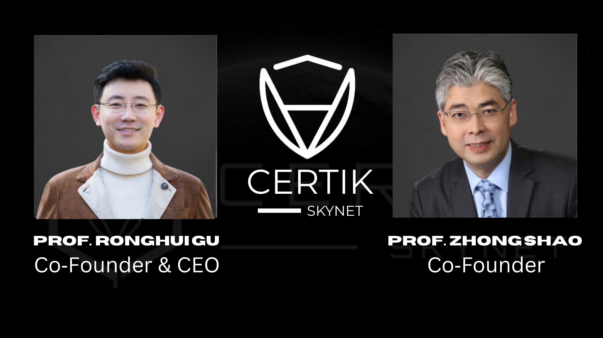

**Founded in 2018** by real professors from Yale and Columbia (not Twitter Uni graduates), CertiK had one job:  
**Make sure your favorite blockchain project doesn’t go boom.**  
Not with vibes. With real tech. And AI. And brain. 🧠

---

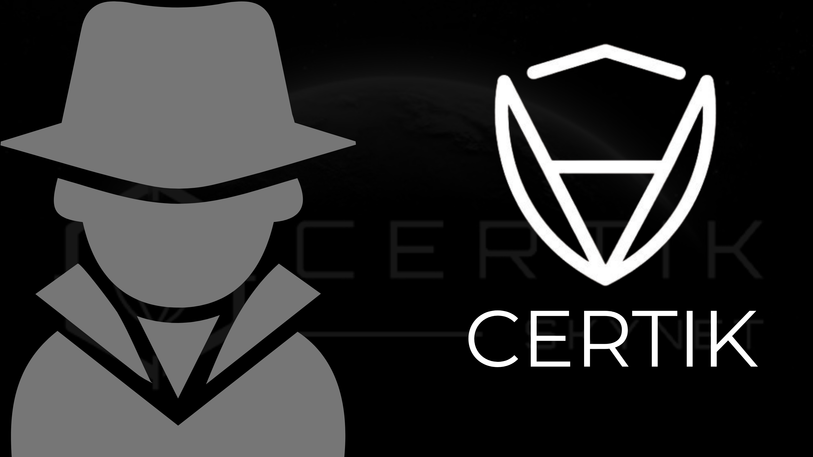

Here’s what CertiK *really* does (in plain English):

- 🛠 Reads smart contracts like bedtime stories
- 🐛 Catches bugs before hackers do
- 📊 Rates projects on how likely they are to mess up
- ✅ Helps projects look legit — so *you* don’t lose money

Basically, they’re the Web3 version of **FBI + antivirus + therapy**.

---

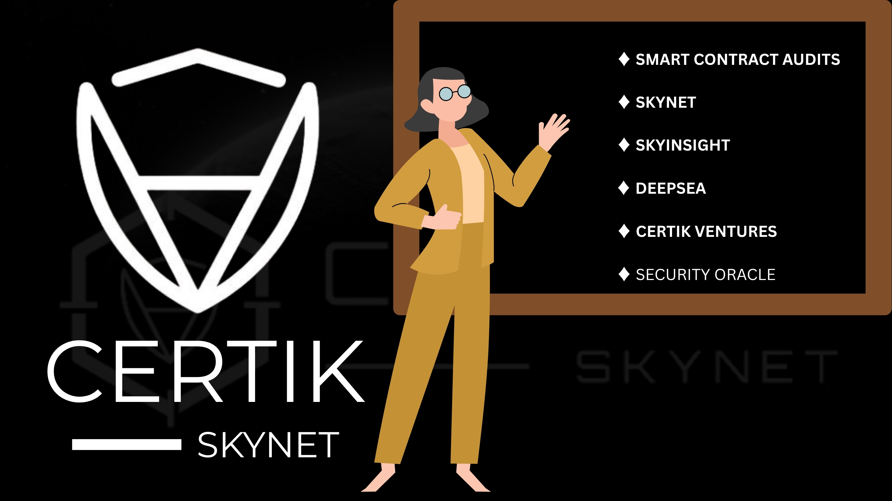

Let’s break their tools down like school subjects:

- 🔎 **Smart Contract Audits** = They check if your code is trash or treasure.  
- ⚙️ **Skynet** = A robot that watches Web3 projects 24/7. Like your mama watching who you follow.  
- 💼 **SkyInsights** = For anti-money laundering. Because crypto isn’t lawless (in theory).  
- 👨🏽‍🏫 **DeepSEA** = A safe compiler. Like Google Translate, but for nerds.  
- 💸 **CertiK Ventures** = They fund secure ideas — not bathroom-born meme coins.  
- 🧙🏽‍♂️ **Security Oracle** = Real-time risk ratings. Think crypto horoscope… but accurate.

---

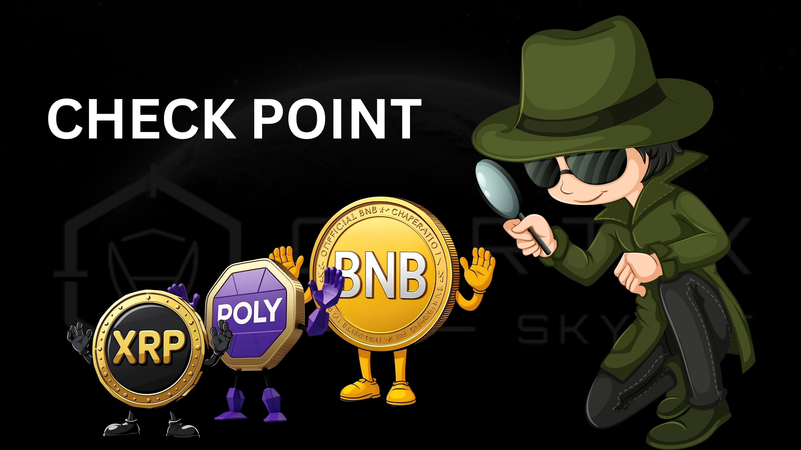

They’ve audited **4,900+** projects.  
Including heavyweights like:

- Ripple  
- Polygon  
- BNB Chain  

Basically, your favorite token knows CertiK better than it knows liquidity.

---

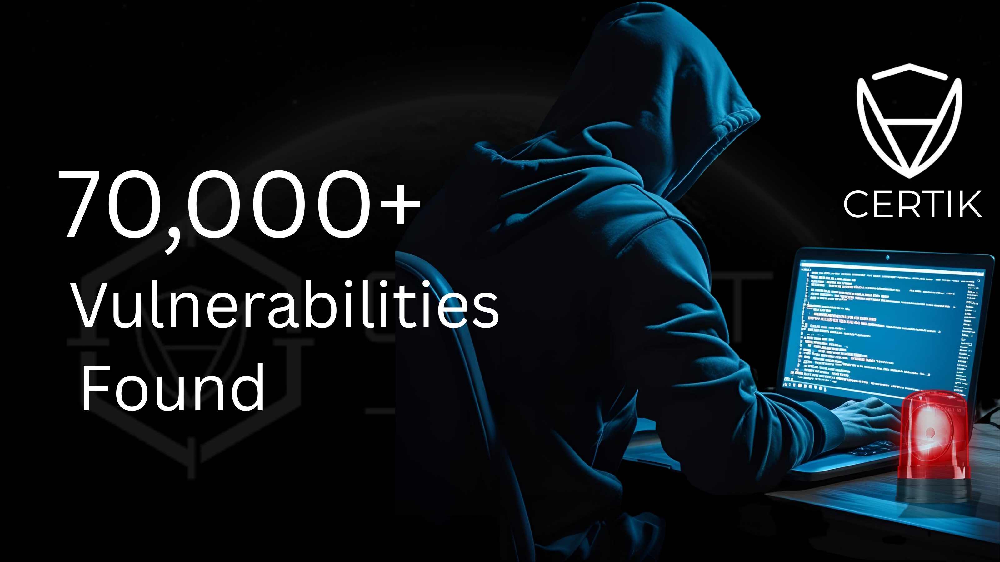

Now here’s a crazy stat:

**70,000+ vulnerabilities** found in blockchain projects.  
That’s like finding 70,000 holes in the Titanic *before* it hits the iceberg.

---

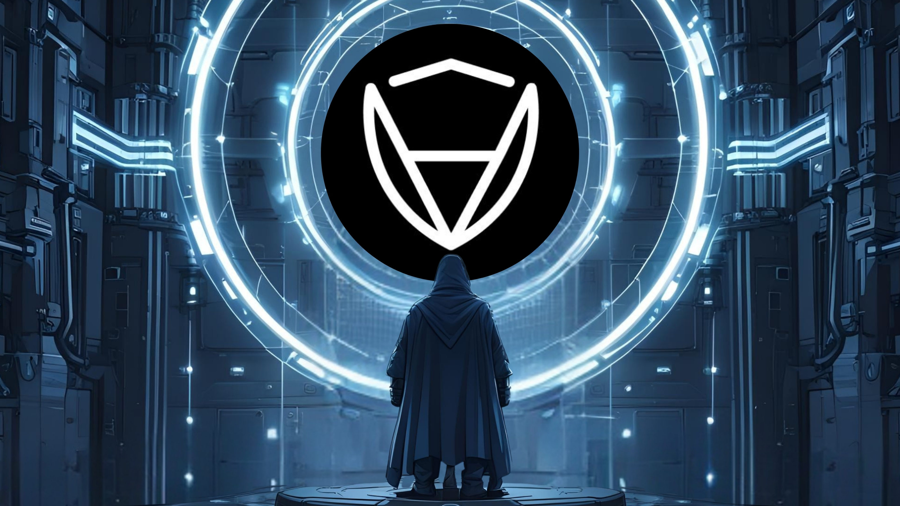

CertiK has protected **$380+ BILLION** worth of digital assets.  

That’s enough money to buy:

- All the blue checks on X  
- All your exes’ apologies  
- A country (or two)

---

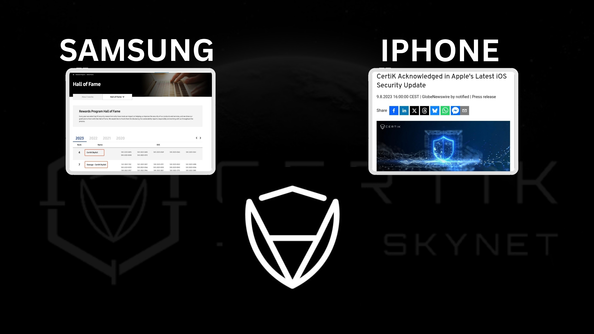

CertiK didn’t stop at “protection.”  
They also:

- Got shout-outs from Samsung and Apple  
- Snitched on bugs in **iOS 17**  
- Saved **TON** and **SEI** from launch-time meltdowns  
- Found bugs in **XRP Ledger’s XLS-30d**

They’re the reason some blockchains didn’t catch fire on launch day. 🔥

---

CertiK is not just code. They’re also **clout**:

- Raised **$296 million**  
- Valued at **$2 billion**  
- Backed by: Sequoia, Coinbase Ventures, Goldman Sachs, etc.

They’re not flexing. They’re funded. 💼💸

---

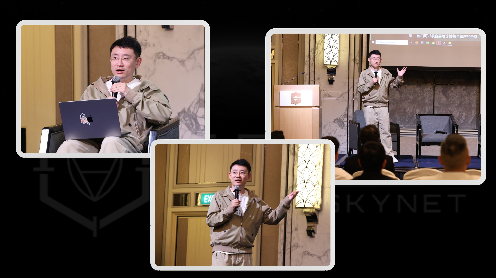

Their CEO **Ronghui Gu** isn’t just chilling in a lab coat.  
He advises:

- The **Monetary Authority of Singapore**  
- **Hong Kong’s Web3 Task Force**

From classroom to crypto policymaker. **Respect.**

---

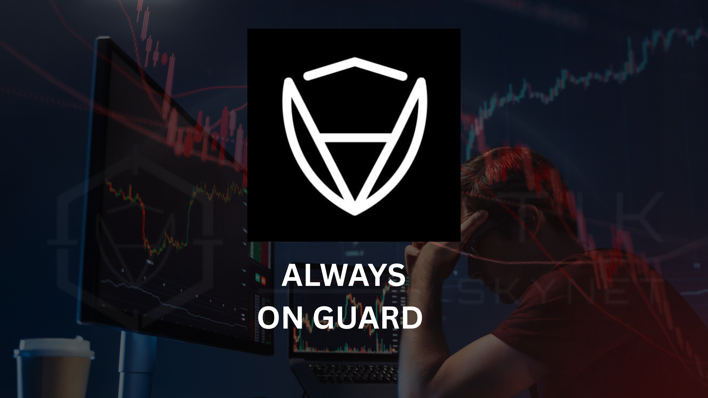

**2024–2025 was chaos for crypto**, but CertiK stayed locked in:

- 🔥 $302M lost in May 2025 alone  
- 🚨 4,484% spike in code-related losses  
- 🧠 Focused on **user security**: phishing & wallet protection now top threats

They’re shifting from “fix the code” to **“save the people.”**

---

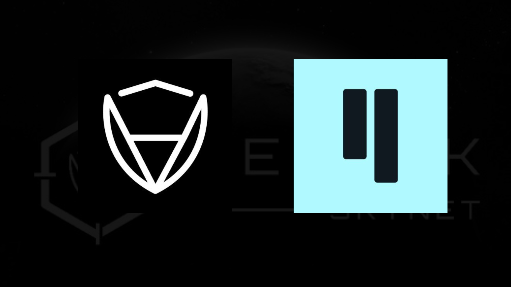

They’re also deep into **node operations** now.  
You’ll find CertiK nodes on chains like **Qubic** — helping decentralize the future.

---

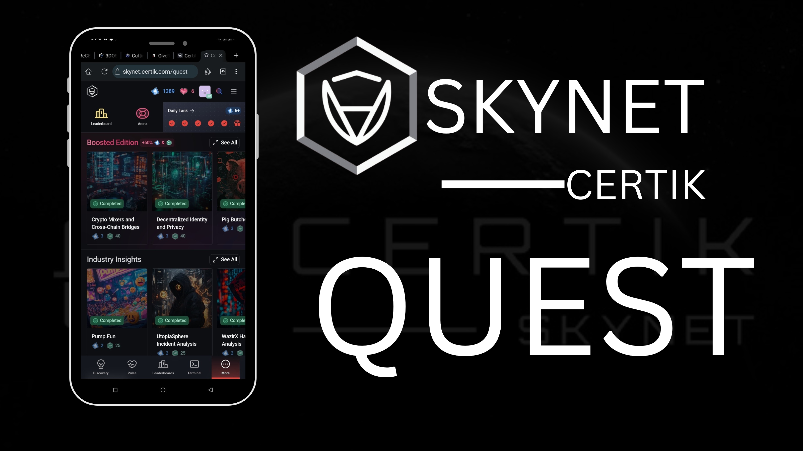

They even run **hacker bootcamps** via hackathons and mentorships.

Imagine being trained by the team that saved **Apple’s kernel** and protected **billions**.

---

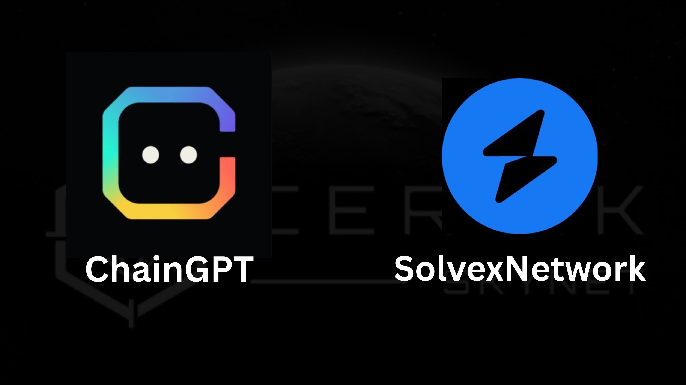

CertiK recently partnered with:

- 🤖 **ChainGPT** (AI-powered token scanning)  
- 🛠 **SolvexNetwork** (secure Web3 dev stack)

When a project says *“Audited by CertiK”*,  
It’s not hype — it’s like getting your car checked by **NASA** before a road trip.

---

But wait… the **bad guys evolved**.

**2024 was the year of phishing and fake friends.**  
Over **$1 BILLION** lost from social engineering.

CertiK’s answer?

- 🛡 Real-time monitoring  
- 👛 Wallet protection  
- 📚 Education

Because sometimes the danger isn’t in the code — it’s in the DMs.

---

CertiK reports now focus more on **human error** than just code flaws.

Their new motto could be:  
> “We can secure your code, but **please**, stop clicking shady links.”

---

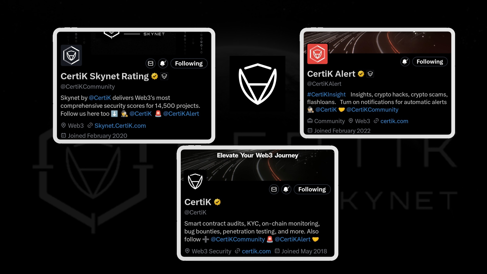

**Want to stay safe in Web3?**

- Stick with projects audited by **CertiK**  
- Don’t talk to strangers promising airdrops  
- Use wallets with **threat monitoring**  
- Learn! CertiK has free tools, dashboards, and reports

They’re not selling you dreams. They’re stopping nightmares. 💀

---

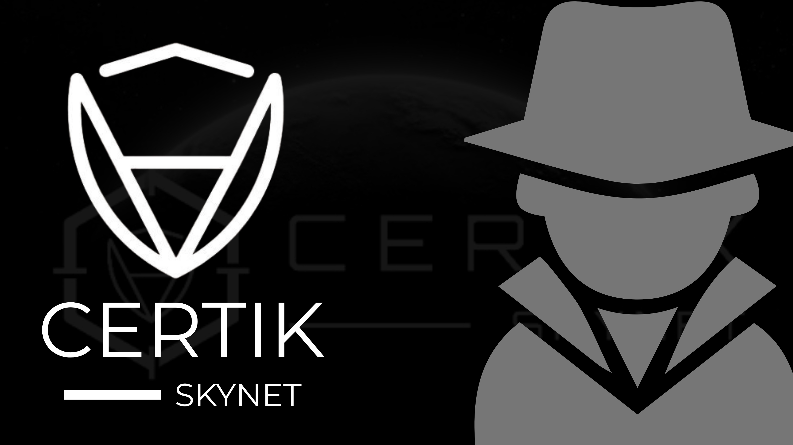

**CertiK is your Web3 bodyguard, code therapist, and watchdog in one.**

They audit, educate, monitor, invest, and advocate.

> If crypto was the Wild West, CertiK is the **sheriff** — with a **PhD and AI sidekick** 🤖

---

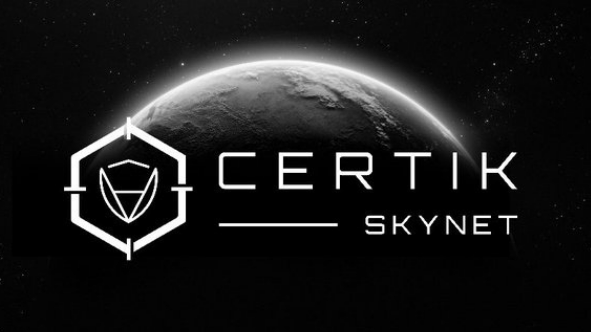

If you’re **building** in Web3, a CertiK audit is the new “I made it.”  
If you’re **investing**, look for the **CertiK seal**.  
If you’re **scamming**… good luck hiding.

---

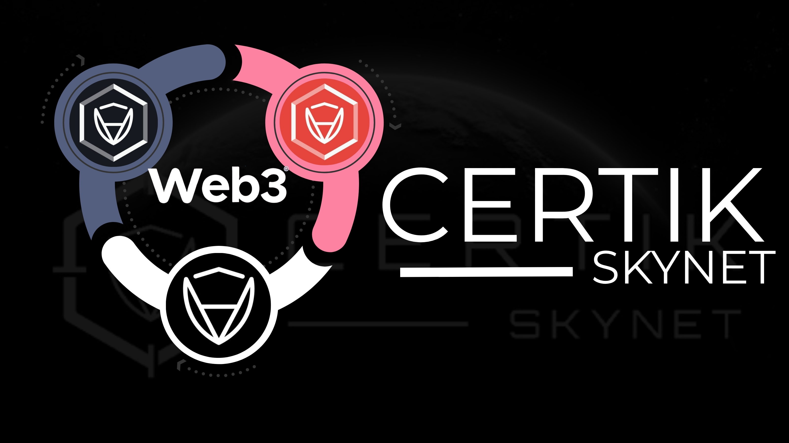

- 🔍 Follow [@CertiK](https://x.com/CertiK)  
- 🌐 Visit [certik.com](https://certik.com)  
- 📑 Read the reports *before* you YOLO into that frog coin

Stay safe. Stay audited. Don’t get rugged.

---

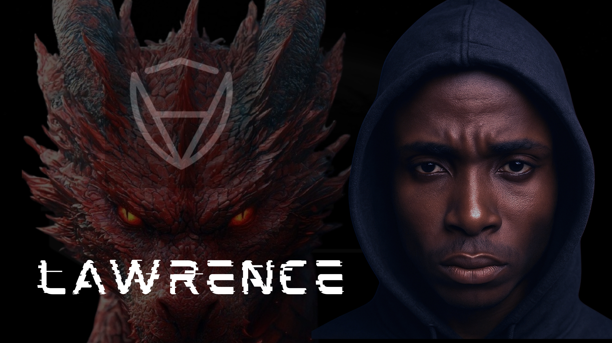

🔥 Unlock the mind behind the movement 🔥  
Catch more threads, insights, and wild ideas that actually make sense.

📍Follow me on X: [@DEDONFXOFFICIAL](https://x.com/DEDONFXOFFICIAL)

This is just the surface.  
**Dive deeper.*
